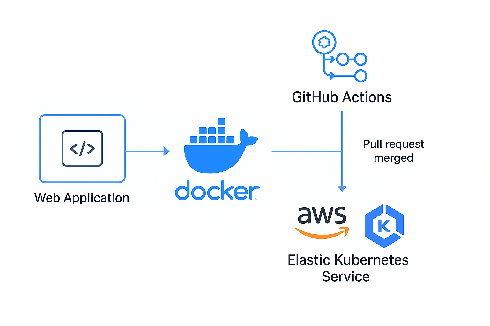

# Flask App on Amazon EKS

[](https://img.shields.io/github/v/release/navendu-pottekkat/awesome-readme?include_prereleases)
[](https://img.shields.io/github/last-commit/navendu-pottekkat/awesome-readme)
[](https://img.shields.io/github/issues-raw/navendu-pottekkat/awesome-readme)
[](https://img.shields.io/github/issues-pr/navendu-pottekkat/awesome-readme)
[](https://img.shields.io/github/license/navendu-pottekkat/awesome-readme)

This project demonstrates how to containerize a simple Flask application and deploy it on **Amazon EKS (Elastic Kubernetes Service)**.

---

## 🚀 Quick Start Demo



This project walks you through:
- Creating a Docker image for a Flask app
- Deploying it to a Kubernetes cluster hosted on EKS
- Accessing it through a LoadBalancer or Ingress

---

## 🧭 Table of Contents

- [Flask App on Amazon EKS](#flask-app-on-amazon-eks)
- [Quick Start Demo](#-quick-start-demo)
- [Table of Contents](#-table-of-contents)
- [Installation](#-installation)
- [Usage](#-usage)
- [Development](#-development)
- [Contribute](#-contribute)
- [License](#-license)

---

## ⚙️ Installation
[(Back to top)](#table-of-contents)

> Make sure you have Docker, AWS CLI, kubectl, eksctl, and Helm installed.

### 1. Clone the repo
```bash
git clone https://github.com/your-username/zero-to-production.git
cd zero-to-production
```

### 2. Build the Docker image
```bash
docker build -t flask-app:latest .
```

### 3. Push to ECR (Optional)
Follow [AWS ECR instructions](https://docs.aws.amazon.com/AmazonECR/latest/userguide/docker-push-ecr-image.html).

### 4. Create EKS Cluster
```bash
eksctl create cluster --name flask-cluster --region us-west-2 --nodes 2
```

---

## 📦 Usage
[(Back to top)](#table-of-contents)

### Deploy Flask App
```bash
kubectl apply -f k8s/deployment.yaml
kubectl apply -f k8s/service.yaml
```

### Check External IP
```bash
kubectl get svc flask-service
```
Access the app using the external IP in your browser.

---

## 🛠️ Development
[(Back to top)](#table-of-contents)

Want to run it locally?

```bash
# Create a virtual environment
python3 -m venv venv
source venv/bin/activate

# Install dependencies
pip install -r requirements.txt

# Run the Flask app
python app.py
```

---

## 🤝 Contribute
[(Back to top)](#table-of-contents)

Want to contribute? Awesome! Open a pull request or issue. Contributions and suggestions are always welcome.

---

## 📄 License
This project is licensed under the [MIT license](./LICENSE).